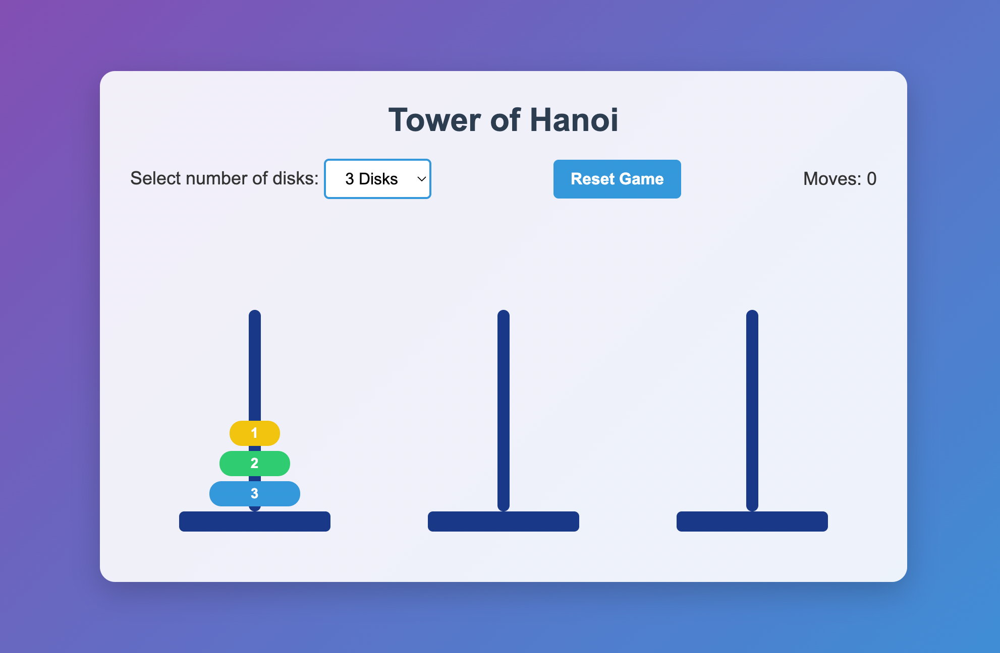

# Tower of Hanoi

A classic Tower of Hanoi puzzle game implemented in pure HTML, CSS, and JavaScript. Test your problem-solving skills with this beautiful and interactive web-based version.



## Table of Contents
- [Game Description](#game-description)
- [How to Play](#how-to-play)
- [Features](#features)
- [Installation](#installation)
- [Development](#development)
- [Mathematics Behind the Game](#mathematics-behind-the-game)
- [Credits](#credits)
- [License](#license)

## Game Description
The Tower of Hanoi is a classic mathematical puzzle that consists of three rods and a number of disks of different sizes. The puzzle starts with all disks stacked on the first rod in ascending order of size (the smallest at the top).
The objective is to move the entire stack to the third rod following these rules:
- Only one disk can be moved at a time
- Each move consists of taking the upper disk from one stack and placing it on top of another stack or an empty rod
- No disk may be placed on top of a smaller disk

## How to Play
1. **Setup**: The game starts with 3, 4, or 5 disks (based on your selection) stacked in descending order on the first tower.
2. **Goal**: Move all disks to the third tower in the same order.
3. **Rules**:
   - Only one disk can be moved at a time
   - Only the top disk from any tower can be moved
   - A larger disk cannot be placed on top of a smaller disk

4. **Controls**:
   - Click on a tower to select it (the top disk will lift up)
   - Click on another tower to move the disk
   - The "Reset" button restarts the game
   - Use the dropdown to select the number of disks (3, 4, or 5)

5. **Winning**: When all disks are successfully moved to the third tower, an animation will appear with a congratulatory message showing how many moves you made.

## Features
- **Responsive Design**: Works on desktop, tablet, and mobile devices
- **Interactive UI**: Visual feedback for disk selection and movement
- **Difficulty Levels**: Choose between 3, 4, or 5 disks
- **Move Counter**: Tracks how many moves you've made
- **Animations**: Smooth animations for disk movements and win celebration
- **Color-Coded Disks**: Each disk has a unique color for better visibility
- **Reset Functionality**: Start over at any time

## Installation
This game runs directly in your web browser. No installation is required!
1. **Clone the repository**:
``` bash
   git clone https://github.com/freilind/hanoi
```
1. **Open the game**:
   - Navigate to the project folder
   - Open in your favorite browser `index.html`

Alternatively, you can play the game online at [your-demo-link-here](https://example.com).

## Docker Setup
You can also run the game using Docker:

### Using Docker directly

# Build the Docker image
```bash
docker build -t hanoi-web -f root/Dockerfile .
```
# Run the container
```bash
docker run -p 8080:80 hanoi-web
```
# Access the game at [http://localhost:8080](http://localhost:8080)

### Using Docker Compose
1. Make sure you have Docker and Docker Compose installed
2. Run the following command from the project root:
```bash 
docker-compose -f root/docker-compose.yml up -d
``` 
3. Access the game at http://localhost:8080
4. To stop the container:
```bash 
docker-compose -f root/docker-compose.yml down
```

## Development
The game is built using:
- HTML5 for structure
- CSS3 for styling and animations
- Vanilla JavaScript for game logic

### Project Structure
- - Main HTML document `index.html`
- - All styling and animations `styles.css`
- - Game logic and interactions `app.js`

## Mathematics Behind the Game
The Tower of Hanoi puzzle has an interesting mathematical background:
- The minimum number of moves required to solve the Tower of Hanoi puzzle is 2^n - 1, where n is the number of disks.
- For example:
   - 3 disks: 7 moves
   - 4 disks: 15 moves
   - 5 disks: 31 moves

This makes the game an excellent exercise in recursive thinking and algorithm design.
## Credits
- Game concept: Tower of Hanoi mathematical puzzle
- Implementation: myself with AI code Claude 3.7 Sonnet 
- Inspired by the classical Tower of Hanoi puzzle created by the French mathematician Édouard Lucas in 1883.

## License
This project is licensed under the MIT License - see the LICENSE file for details.
Enjoy the game and challenge your friends to solve it with fewer moves than you!

